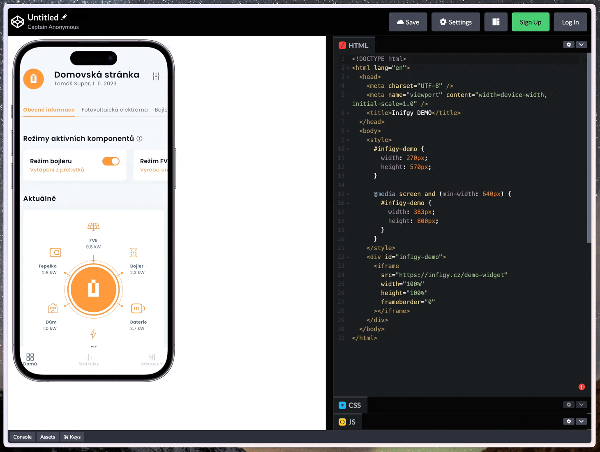
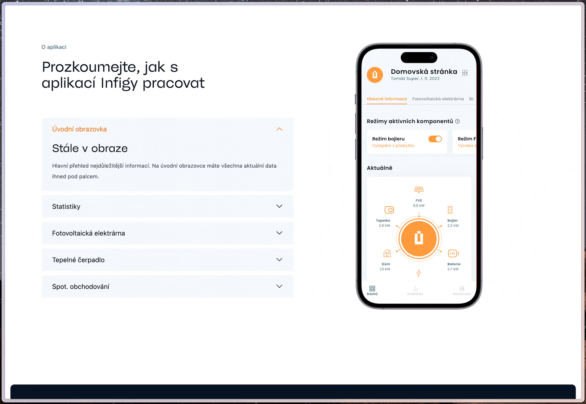

# Infigy demo app web widget

## Code

```html
<style>
  #infigy-demo {
    width: 270px;
    height: 570px;
  }

  @media screen and (min-width: 640px) {
    #infigy-demo {
      width: 383px;
      height: 800px;
    }
  }
</style>
<div id="infigy-demo">
  <iframe
    src="https://infigy.cz/demo-widget"
    width="100%"
    height="100%"
    frameborder="0"
  ></iframe>
</div>
```

## Example



## How it works on infigy.cz


